Informe comparación de desarrollo móvil en Flutter y
React Native

Programación Móvil

Sebastian Monsalve Otero, Isabella Montes Palencia y Moisés Vega Molino

Universidad del Norte

Barranquilla, Colombia

Mayo de 2026

**Problema a tratar**

El objetivo de la actividad es comparar de manera objetiva y técnica,
mediante el uso de métricas numéricas, el desarrollo de una misma
aplicación móvil utilizando tanto Flutter como React Native con Expo.
Ambos acercamientos tienen exactamente las mismas funciones, estructuras
y lógica, consumiendo datos de una API REST pública y permitiendo hacer
operaciones CRUD sobre registros en memoria.

**Descripción de la aplicación**

Las aplicaciones desarrolladas son un Pokédex que consume la API pública
de PokeAPI *https://pokeapi.co/api/v2/pokemon*. Ambas versiones fueron
construidas siguiendo Clean Architecture, separando las capas de datos,
dominio y presentación.

Las funcionalidades implementadas son:

\- Lista paginada de Pokémon con scroll.

\- Pantalla de detalle al seleccionar un Pokémon.

\- Formulario de creación y edición de registros

\- Operaciones CRUD simuladas en memoria RAM sin persistencia local

Version de React Native:

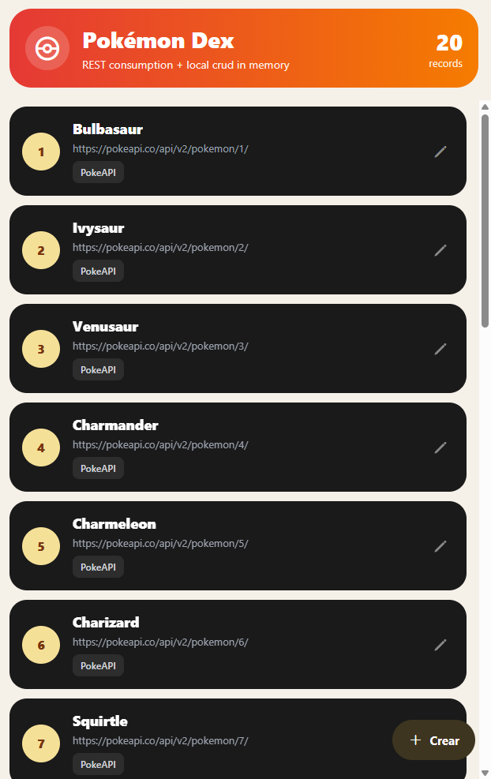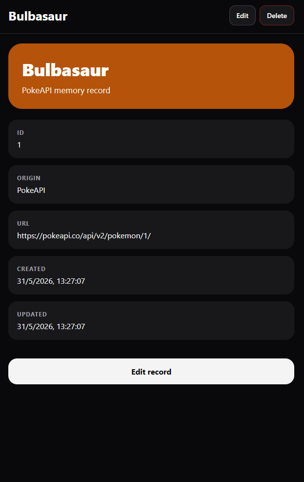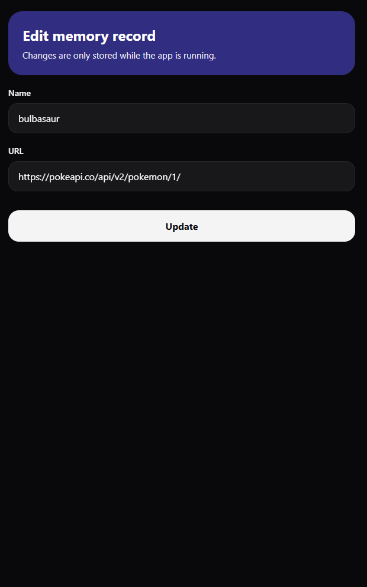

Version de Flutter:

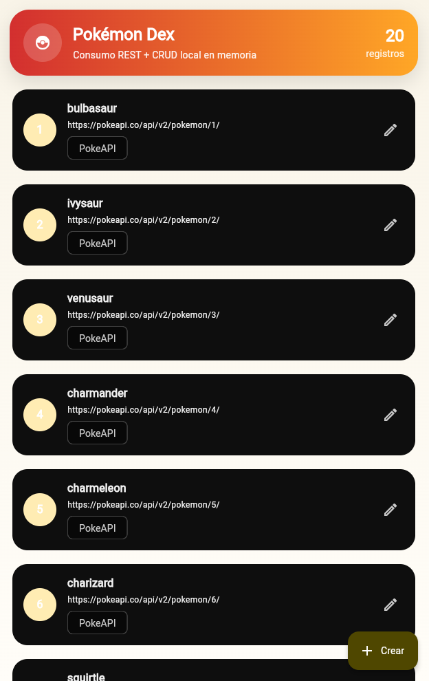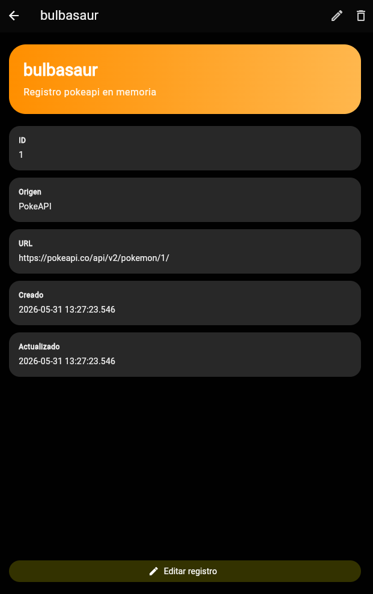

**Métricas de rendimiento**

Todas las mediciones se realizan sobre dispositivos físicos.

Datos resumidos:\
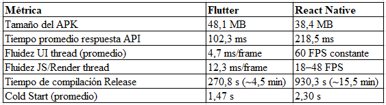

**Análisis por métrica**

1.  Tamaño del APK:

> Flutter generó un APK de 48,1 MB, mientras que React Native generó uno
> de 38,4 MB, siendo React Native aproximadamente 9,7 MB más liviano en
> este caso. El APK de Flutter incluye de forma obligatoria su motor de
> renderizado (Impeller/Skia), el runtime de Dart y datos de
> internacionalización (ICU), lo que representa un overhead base fijo
> que se carga independientemente del tamaño de la aplicación. React
> Native, al usar componentes nativos del sistema y un runtime de
> JavaScript más ligero (Hermes), puede producir un binario menor cuando
> la lógica de la app es relativamente simple y no requiere grandes
> librerías nativas adicionales.
>
> Cabe aclarar que esta relación no es una regla general: en
> aplicaciones con muchos assets, librerías nativas complejas o
> múltiples dependencias de Expo, el tamaño de React Native puede crecer
> rápidamente y superar al de Flutter. En este caso particular, al
> tratarse de una app funcionalmente ligera, el overhead base del motor
> gráfico propio de Flutter resultó mayor que el del runtime de
> JavaScript de React Native.
>
> 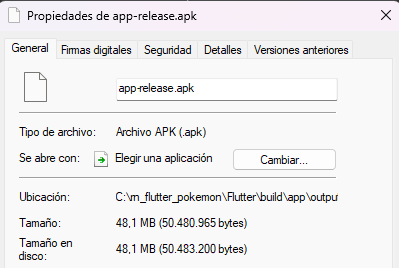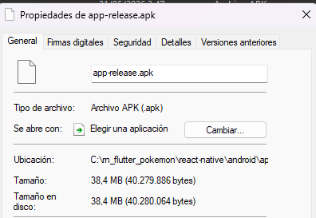

2.  Tiempo de respuesta del API:

> Se hicieron diversas peticiones consecutivas a PokeAPI desde cada app,
> midiendo el tiempo desde el inicio de la solicitud HTTP hasta la
> recepción de la respuesta completa. En Flutter se usó Stopwatch en
> Dart; en React Native se usó performance.now() en TypeScript sobre el
> hilo de JavaScript. Ambas apps solicitaron páginas de 20 Pokémon con
> offsets crecientes sobre la misma conexión de red Wi-Fi.
>
> 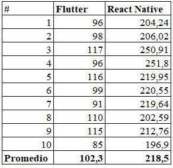
>
> Flutter registró tiempos entre 85 ms y 117 ms, con un promedio de
> 102,3 ms. React Native registró tiempos entre 196,9 ms y 251,8 ms, con
> un promedio de 218,5 ms. React Native fue aproximadamente 2,1× más
> lento en este escenario, con una varianza mayor.
>
> La diferencia puede explicarse porque en React Native el cronómetro
> corre en el hilo de JavaScript, capturando no solo el tiempo de red
> sino también el overhead de serializar la respuesta a través del
> puente nativo-JS y el posible bloqueo del hilo por parseo de JSON. En
> Flutter, la medición se realiza directamente en el hilo de Dart, que
> opera sobre sockets nativos sin intermediarios. Cabe señalar que ambos
> frameworks transfieren los mismos bytes por la misma red; la brecha
> observada corresponde al procesamiento interno posterior a la
> recepción de la respuesta, no a una latencia de red distinta.
>
> Flutter:

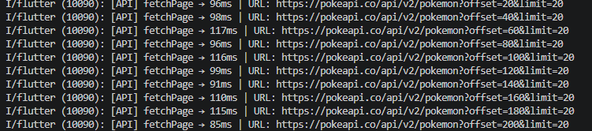

React:

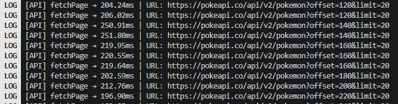

3.  Fluidez de la interfaz:

> Flutter fue medido con Flutter DevTools en modo Profile, obteniendo un
> promedio de 4,7 ms/frame en el hilo UI y 12,3 ms/frame en el hilo
> Raster, muy por debajo del presupuesto de 16,6 ms para 60 FS.P Los
> picos de hasta 43,1 ms corresponden al primer frame de carga de
> pantalla.
>
> React Native mostró el hilo UI nativo fijó en 60 FPS, pero el hilo de
> JavaScript osciló entre 18 y 48 FPS durante el scroll de listas
> largas. Ambas plataformas ofrecen una experiencia aceptable para el
> usuario, aunque Flutter presentó métricas más uniformes.
>
> 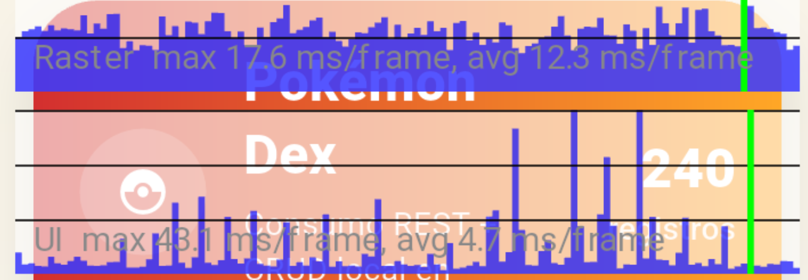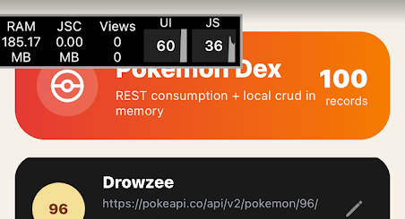

4.  Tiempo de compilación:

> Forma de medir Build de release local en la misma máquina de
> desarrollo. Para Flutter: flutter clean + flutter build apk --release.
> Para React Native: ./gradlew assembleRelease sin clean previo, debido
> a incompatibilidad de CMake con la New Architecture en Windows.
>
> Flutter compiló el APK en modo release desde estado limpio
> aproximadamente 3,4× más rápido que React Native con Expo (270,8 s vs
> 930,3 s). Esta diferencia puede explicarse por el enfoque de
> compilación de Flutter, que genera código nativo mediante AOT y un
> único proceso de build más integrado. En contraste, React Native con
> Expo combina varias etapas, incluyendo el empaquetado del JavaScript
> mediante Metro, la compilación de dependencias nativas con Gradle y la
> integración de módulos nativos del ecosistema Android, lo que puede
> incrementar el tiempo total de construcción dependiendo de la
> configuración del proyecto.
>
> Flutter:
>
> 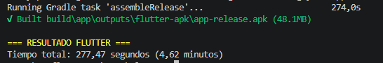
>
> React:
>
> 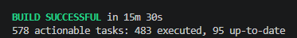

5.  Cold Start:

> Medido en un Kalley Black G2 (mismo dispositivo para ambas apps),
> llevando a cabo cierre completo de la aplicación entre lanzamientos y
> cronometrando manualmente el tiempo desde el toque del ícono hasta la
> renderización completa de la primera pantalla.
>
> Flutter promedió 1,47 s (1,8 s / 1,4 s / 1,2 s) y React Native 2,30 s
> (2,3 s / 2,2 s / 2,4 s). La diferencia de aproximadamente 0,83 s fue
> consistente en las tres mediciones y se explica porque React Native
> debe inicializar el runtime Hermes, cargar el bundle JS y establecer
> la comunicación con el hilo nativo antes de mostrar la primera
> pantalla, mientras que Flutter arranca directamente desde código
> nativo compilado AOT. Como apunte importante un dispositivo de gama
> media como el Kalley Black G2, esa penalización es más perceptible que
> en hardware de gama alta. Además es importante aclarar que la medición
> manual introduce un margen de error, por lo que la diferencia es una
> aproximación; sin embargo, el que se repita de manera consistente la
> respalda el hallazgo para este caso de uso.

**Conclusión**

Desarrollar la misma aplicación en Flutter y React Native (Expo)
confirmó que ninguna plataforma domina todas las métricas; los
resultados dependen del caso de uso, la configuración del build y el
hardware. Flutter destacó en consistencia: frames uniformes bajo el
presupuesto de 60 FPS, menor tiempo de respuesta medido, arranque más
rápido (1,47 s vs 2,30 s) y compilación release más ágil (4,5 min vs
15,5 min). Su arquitectura AOT autocontenida explica estas ventajas,
aunque también su mayor tamaño de APK (48,1 MB vs 38,4 MB). El hot
reload por debajo de 1 segundo también favoreció la velocidad de
iteración durante el desarrollo. React Native con Expo compensa con un
binario más liviano, builds incrementales rápidos (66 s con caché) y su
integración natural con componentes del sistema. Sin embargo, el
overhead del hilo de JavaScript se tradujo en mayor latencia de red
medida y scroll menos uniforme en listas largas (18–48 FPS). En
conclusión, cada framework cuenta con fortalezas, Flutter es preferible
cuando la fluidez, la predictibilidad del rendimiento y el ciclo de
desarrollo ágil son prioritarios, especialmente en dispositivos de gama
media. React Native con Expo sigue siendo viable cuando el tamaño del
binario es una restricción, el equipo domina el ecosistema React, o se
requiere integración profunda con módulos nativos existentes.
